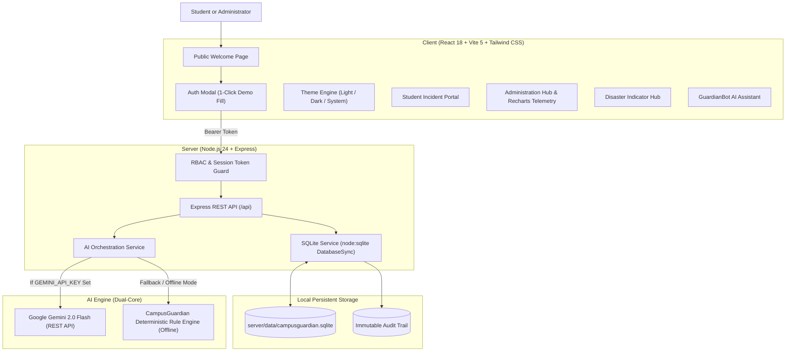

# 🛡️ CampusGuardian AI
> **"A Safer Campus. A Smarter Response."**

[](#)
[](#)
[](#)
[](#)
[-brightgreen.svg)](#)

---

## 📌 Project Overview
**CampusGuardian AI** is an enterprise-grade smart campus safety, incident reporting, and emergency operations platform built for engineering hackathons and university campus administrations.

Campus operations often suffer from departmental silos, slow ticketing resolution, and fragmented emergency broadcast channels. When physical hazards or accessibility barriers emerge, students struggle with confusing bureaucratic forms while administrators lack real-time situational telemetry.

**CampusGuardian AI bridges this gap with:**
1. **Natural Language Issue Reporting**: Students report hazards, lighting failures, or broken access ramps in plain, everyday language.
2. **Dual-Core AI Triage Engine**: Automatically predicts incident categories (**Fire Safety, Electrical Issue, Building Maintenance, Security, Medical Assistance, Accessibility, Sanitation, Other**), calculates triage priority (**Critical, High, Medium, Low**), routes to the responsible department, and suggests immediate remedial actions with confidence metrics.
3. **Persistent SQLite Administrative Database**: High-performance persistent database using Node's native `DatabaseSync` engine (`server/data/campusguardian.sqlite`). Every report, status change, and audit event remains durable across page reloads and backend restarts.
4. **Disaster Indicator & Campus Emergency Broadcasts**: Centralized emergency broadcast console for administrators with severe weather, fire, earthquake, and security threat lifecycle management (Drafting → Preview → 2-Step Critical Confirmation → All-Clear Declarations → Student Acknowledgement Tracking).
5. **Role-Based Access Control (RBAC) & Secure Persistent Sessions**: Distinct Student and Administration portals with cryptographically salted `scrypt` password verification, session tokens, and strict server-side authorization guards.
6. **Dynamic Theme Engine**: Seamless instant switching between a crisp Light Mode, deep cyber Dark Mode, or System Default with persistent user preferences.

---

## 🎯 Smart Campus Solutions: Alignment with Problem Statement

### 🔴 The Core Problem
Campus incidents may be reported late, important information may be scattered across disparate systems, and administrators often lack a unified view of incidents and response progress.

### 🟢 The Proposed Solution
CampusGuardian AI provides a single, centralized platform for reporting incidents, prioritizing response operations, communicating verified campus alerts, and tracking resolution end-to-end.

### 🔗 Mapping Features to the Solution
* **Student Incident Reporting**: Empowers students to file reports effortlessly in a mobile-friendly interface.
* **AI-Assisted Categorization**: Uses AI to suggest priorities and categorize issues instantly, speeding up triage.
* **Centralized Admin Dashboard**: Gives administrators a unified view to manage all incidents across campus.
* **Persistent History**: Keeps an immutable timeline of status updates, actions, and audit logs.
* **Disaster Indicator**: Issues clear, top-level broadcasts with explicit instructions and affected-area details.
* **Student Visibility**: Allows students to track the progress of their submitted reports.

### 📊 Measurable Evaluation Metrics (Proposed for Live Deployment)
1. **Report-Processing Time**: The time from student submission to administrator assignment.
2. **Classification Accuracy**: Success rate of AI categorization against a labelled historical dataset.
3. **Workflow Completion Rate**: Percentage of reports that move from "Submitted" to "Resolved".
4. **API Response Time**: Server latency and stability under concurrent user load.

---

## 🏗️ System Architecture



---

## 🔑 Demo Account Credentials

For engineering hackathon judges, two pre-seeded development accounts are configured in the SQLite database and can be filled with a single click in the **Sign In** modal:

| Portal | Demo Email | Demo Password | Role & Permissions |
| :--- | :--- | :--- | :--- |
| **Student Portal** | `student@campusguardian.demo` | `student123` | File campus reports, track personal report status, view Disaster Indicator alerts, acknowledge warnings, access emergency guides. |
| **Administration** | `admin@campusguardian.demo` | `admin123` | View all campus reports, update workflow statuses, assign departments & staff, add admin notes, publish campus disaster alerts, issue all-clear notices, export CSV/JSON, inspect audit logs. |

> **Development Note**: Demo credentials are enabled only in development environments (`NODE_ENV=development` and `DEMO_ACCOUNTS_ENABLED=true`). In production mode, demo accounts are disabled and passwords can be configured via environment variables.

---

## 🚀 Getting Started & Installation

### Prerequisites
- **Node.js**: v20+ or v24+ (Node v24 provides built-in `node:sqlite`)
- **npm**: v10+

### 1. Repository Setup & Dependencies
Install dependencies for both the frontend and backend with a single command from the project root:

```bash
# From vaibhav-patil-24SUUBEAML673-
npm run install:all
```

Alternatively:
```bash
cd server && npm install
cd ../client && npm install
```

### 2. Environment Configuration
Copy `.env.example` into `server/.env`:

```bash
cp .env.example server/.env
```

Default configuration in `server/.env`:
```env
PORT=5000
NODE_ENV=development
SESSION_EXPIRY_HOURS=168

# Hackathon Demo Credentials (Development Only)
DEMO_ACCOUNTS_ENABLED=true
DEMO_STUDENT_EMAIL=student@campusguardian.demo
DEMO_STUDENT_PASSWORD=student123
DEMO_ADMIN_EMAIL=admin@campusguardian.demo
DEMO_ADMIN_PASSWORD=admin123

# Optional: Google Gemini API Key
# If omitted or invalid, CampusGuardian AI automatically switches to the built-in Local Fallback AI Rule Engine
GEMINI_API_KEY=
```

### 3. Database Initialization
The SQLite database initializes and seeds automatically upon the first server launch:
- Database location: `server/data/campusguardian.sqlite`
- Automatic tables created: `users`, `sessions`, `reports`, `alerts`, `alert_acknowledgements`, `audit_logs`.
- Pre-seeded with 5 realistic university incidents, 2 disaster indicator notices, and the 2 demo accounts.

### 4. Running the Application Locally

#### Option A: Run Both Client & Server Concurrently (Recommended)
```bash
npm run dev
# or
npm start
```

#### Option B: Run Server and Client in Separate Terminals
**Terminal 1 (Backend API Server):**
```bash
cd server
npm start
# Server starts at http://localhost:5000
```

**Terminal 2 (Frontend Client):**
```bash
cd client
npm run dev
# Client starts at http://localhost:3000 (or http://localhost:5173)
```

Visit the application in your browser at `http://localhost:3000` (or `http://localhost:5000` if serving client build).

---

## 🧪 Automated Testing & Acceptance Verification

We provide an end-to-end automated verification script (`test_workflow.js`) that tests all 18 hackathon requirements against the live backend:

```bash
npm test
# or
node test_workflow.js
```

### Verification Criteria Tested (47/47 Tests Passing 100%):
1. **System Health Check**: Verifies HTTP 200, online status, and SQLite engine.
2. **Public Telemetry**: Confirms aggregate stats are public while zero student PII is exposed.
3. **Student Authentication**: Authenticates `student@campusguardian.demo` and validates token.
4. **Administrator Authentication**: Authenticates `admin@campusguardian.demo` and validates admin token.
5. **Session Persistence**: Restores user identity via `/api/auth/me`.
6. **Role-Based Access Control (RBAC)**:
   - Student blocked from `/api/audit-logs` (403 Forbidden).
   - Student blocked from `/api/reports/export` (403 Forbidden).
   - Unauthenticated requests rejected from `/api/reports` (401 Unauthorized).
7. **AI Incident Analysis**: Validates natural language classification into `Electrical Issue`, `High` priority, confidence rating, and recommended remedial steps.
8. **Student Report Creation**: Stores new incident report into SQLite database.
9. **Student Data Scoping**: Student only retrieves their own submitted reports.
10. **Admin Data Scoping**: Administrator retrieves all submitted reports across the university.
11. **Admin Status & Notes Update**: Updates status to `In Progress` and verifies timeline entry.
12. **Disaster Indicator Alert Publication**: Administrator broadcasts an active severe weather alert.
13. **Student Alert Visibility**: Active broadcast alerts are visible to students.
14. **Student Alert Acknowledgement**: Student marks alert as acknowledged in SQLite.
15. **Administrator All-Clear Notice**: Declares all-clear with resolution notes.
16. **Audit Trail Logging**: Verifies that administrator actions are logged with timestamps.
17. **Data Export**: Validates CSV and JSON export data generation.
18. **Session Logout**: Verifies session invalidation on logout.

---

## 🛡️ Security Architecture & Privacy Safeguards

1. **Role-Based Access Control (RBAC)**:
   - Authorization is enforced strictly on the server backend. Changing client-side state or URL hashes cannot grant access to administrator APIs.
   - Student requests to admin routes return `403 Forbidden`.
2. **Cryptographic Password Storage**:
   - Passwords are encrypted using Node's native `node:crypto.scryptSync` with unique 16-byte random salts. Plaintext passwords are never stored.
3. **Token-Based Server Sessions**:
   - Sessions are generated with 64-character random cryptographic tokens stored in the SQLite `sessions` table.
   - Configurable session expiration (`SESSION_EXPIRY_HOURS=168`).
   - Logout immediately deletes the session token from SQLite.
4. **Zero Secrets in Frontend**:
   - Gemini API keys, demo account passwords, and database connection secrets remain strictly on the backend.
5. **Public Page Privacy**:
   - The public Welcome Page accesses only sanitized aggregate counters (`/api/stats/public`). Private student names, emails, and specific incident reports are never rendered on public views.
6. **Audit Trail Logging**:
   - Every administrative action (status changes, priority adjustments, work order assignments, disaster alert broadcasts, all-clear declarations) is written to `audit_logs` with actor email, role, action, and timestamp.

---

## ⚠️ Disaster Alert & AI Safety Boundaries

To satisfy engineering hackathon ethics and safety guidelines:
1. **No Automated False Alarms**: The AI incident analyzer is an advisory triage tool and will **never** independently declare a disaster or trigger campus sirens.
2. **Mandatory Human-in-the-Loop Confirmation**: Publishing any `Critical` severity disaster alert requires explicit, two-step confirmation by an authorized administrator.
3. **Simulated Demo Notice**: In-app disaster notices are visibly stamped with `[DEMO / SIMULATED]`.
4. **Emergency Services Boundary**: CampusGuardian AI does not replace municipal 911/112 emergency services or physical campus siren towers. Official contact numbers (Security: 555-0199, Medical: 555-0188) are clearly configured.

---

## 🔮 Future Scope
- **Push Notification Integration**: Web Push / ServiceWorker alerts for real-time background push during critical broadcasts.
- **Physical Sensor Telemetry**: Integration with IoT building smoke sensors, earthquake accelerometers, and flood water level sensors via MQTT.
- **Campus Blue Light GIS Map**: Interactive 3D vector map of physical emergency Blue Light stations with live GPS navigation.
- **Enterprise SSO / SAML 2.0**: University Active Directory / Shibboleth integration for campus-wide single sign-on.

---

## 📄 License
Created for engineering hackathon demonstration. Open source under the MIT License.
